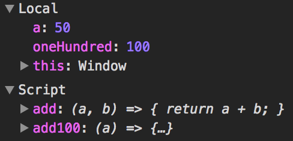

<div align="center">
  <h1>babel-plugin-console</h1>

  🎮

  Adds useful build time console functions
</div>

<hr />

[](https://travis-ci.org/mattphillips/babel-plugin-console)
[](https://codecov.io/github/mattphillips/babel-plugin-console)
[](https://www.npmjs.com/package/babel-plugin-console)
[](http://npm-stat.com/charts.html?package=babel-plugin-console&from=2017-07-17)
[](https://github.com/mattphillips/babel-plugin-console/blob/master/LICENSE)
[](http://makeapullrequest.com)
[](https://github.com/mattphillips/babel-plugin-console/blob/master/docs/ROADMAP.md)
[](https://github.com/mattphillips/babel-plugin-console/blob/master/docs/EXAMPLES.md)
[](https://github.com/kentcdodds/babel-macros)

## Problem

Ever find yourself using `console.log` to work out what the heck is going on within your functions?
And then put too many variables into the log and lose context of which value is which variable?

## Solution

These problems can be solved by a computer at build time. This plugin allows you to inspect a functions parameters, variables, return value and parent scope by adding meaningful logs around the scope of the function - removing the hassle of manual `console.log` statements or debugging.

## Installation

With npm:
```sh
npm install --save-dev babel-plugin-console
```

With yarn:
```sh
yarn add -D babel-plugin-console
```

## Setup

### .babelrc

```json
{
  "plugins": ["console"]
}
```

### CLI

```sh
babel --plugins console script.js
```

### Node

```javascript
require('babel-core').transform('code', {
  plugins: ['console'],
})
```

## APIs

### `console.scope()`

Outputs a collection of messages for a functions entire scope

*Note: this API is the same as the standard `console.log`*

#### Syntax

```js
console.scope(obj1 [, obj2, ..., objN]);
console.scope(msg [, subst1, ..., substN]);
```

#### Parameters

 - `obj1 ... objN`
A list of JavaScript objects to output. The string representations of each of these objects are appended together in the order listed and output.

 - `msg`
 A JavaScript string containing zero or more substitution strings.

 - `subst1 ... substN`
JavaScript objects with which to replace substitution strings within msg. This gives you additional control over the format of the output.

## Usage

### Plugin

```js
const add100 = (a) => {
  const oneHundred = 100;
  console.scope('Add 100 to another number');
  return add(a, oneHundred);
};

const add = (a, b) => {
  return a + b;
};

      ↓ ↓ ↓ ↓ ↓ ↓
```

**Browser:**


**Node:**


### Macros

`babel-plugin-console` also ships with [babel-macros](https://github.com/kentcdodds/babel-macros) supported 🎉

To use a macro you will need to
[install and setup](https://github.com/kentcdodds/babel-macros/blob/master/other/docs/user.md) `babel-macros`.

Once you have enabled `babel-macros` import/require the `scope` macro with:

```js
import scope from 'babel-plugin-console/scope.macro';
// OR
const scope = require('babel-plugin-console/scope.macro');
```

#### Example

*Note: this is the same as the above usage and will generate the same logs - only difference is it uses the scope
macro* 😎

```js
      ↑ ↑ ↑ ↑ ↑ ↑
import scope from 'babel-plugin-console/scope.macro';

const add100 = (a) => {
  const oneHundred = 100;
  scope('Add 100 to another number');
  return add(a, oneHundred);
};

const add = (a, b) => {
  return a + b;
};
```

## Inspiration

[This tweet](https://twitter.com/kentcdodds/status/885604009930768384) led to me watching
[@kentcdodds's](https://github.com/kentcdodds/) live presentation on ASTs. This plugin is an extension on the
`captains-log` demoed - Thanks Kent!

## Other Solutions

You could use a debugger with breakpoints to pause the execution of a function and inspect the values of each variable.

The above `add100` function would look like the following if you used a debugger with a breakpoint:



## Contributors

<!-- ALL-CONTRIBUTORS-LIST:START - Do not remove or modify this section -->
| [<br /><sub>Matt Phillips</sub>](http://mattphillips.io)<br />[💻](https://github.com/mattphillips/babel-plugin-console/commits?author=mattphillips "Code") [📖](https://github.com/mattphillips/babel-plugin-console/commits?author=mattphillips "Documentation") [🚇](#infra-mattphillips "Infrastructure (Hosting, Build-Tools, etc)") [⚠️](https://github.com/mattphillips/babel-plugin-console/commits?author=mattphillips "Tests") | [<br /><sub>Stephen Bluck</sub>](http://www.photobox.com)<br />[📖](https://github.com/mattphillips/babel-plugin-console/commits?author=stevebluck "Documentation") |
| :---: | :---: |
<!-- ALL-CONTRIBUTORS-LIST:END -->

## LICENSE

MIT
